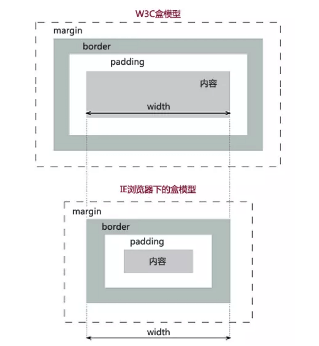

# 前端基础
----
## JavaScript

### 原型链

### 闭包

## HTML

### 行内元素 
`a、img、span、input、testarea、i、em、`

### 块元素
`div p ul ol li dl db dt header footer nav section`

## CSS

### 盒模型
 盒模型分为标准盒模型和IE盒模型两种，相关属性有 width（内容）、padding、border、margin
1. 标准盒模型
   标准盒模型的width就等于内容宽度
2. IE盒模型
   IE盒模型的width = 内容宽度 + padding + border
   如下图对比所示：
   

|盒模型|width|height|
|:---:|:---:|:---:|
|IE盒模型|内容宽度+padding+border|内容高度+padding+border|
|标准盒模型|内容宽度|内容高度|

### BFC
 BFC是块级格式化上下文 (Block Fromatting Context)的缩写，
## Vue

### 生命周期

## React

## weex

## React Native