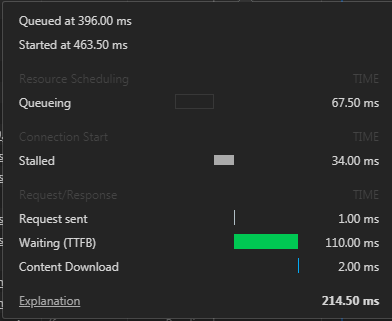

# 前端性能优化准则

## 常用性能优化指标

对于网站性能指标影响最直接的可能是网站的响应速度，一个网站的访问过程大致如下：

```
 用户输入域名 =>
 DNS服务器将域名解析为IP找到目标服务器 =>
 目标服务器收到请求执行服务器与数据库等一系列操作，并通过网络响应数据 =>
 用户浏览器接收响应并解析数据进行页面渲染。
```
1. 网页资源请求与加载阶段

如下图所示一个请求过程



建立连接阶段
* Queueing: 请求队列时间；
* Stalled: 请求等待时间；
请求响应阶段
* Request sent: 浏览器发出请求用时；
* Waiting(TTFB): 等待初始响应用时(等待返回首个字节的时间)；
* Content Download: 从服务器接收数据的时间。


::: tip 总结
* 尽量减少资源访问以及加载阶段耗时。
* 由于chrome浏览器会为每个主句强制设置最多6个TCP连接，可以通过划分子域的方式将资源放置在不同子域上，减少队列等待时间，提高并发请求数量，但是子域数量也不宜过多，过多会增加DNS服务器解析时间，一般为3~5个为宜。
* 提倡前端使用公共CDN服务器来托管类库。
* TTFB耗时更多体现在服务端程序的处理能力上。
:::

2. 网页渲染阶段

浏览器将从服务器获取的HTML文档解析成DOM，与此同时浏览器遇到CSS和JS时也会同步下载，CSS会被解析成CSSOM（层叠样式表模型），JS会交给JS引擎执行。DOM和CSSOM合并解析成渲染树（Rander Tree），Rander Tree上面的节点是RanderObject，DOM Tree也会被递归遍历用来判断是否需要生成新的节点RanderObject并动态加入到DOM中，浏览器不根据Rander Tree来直接渲染页面，而是通过RanderObject生成新的Rander Layout Tree，并遍历Rander Layout Tree生成RanderLayer，根据这个渲染并呈现给用户。

::: tip 总结
* 渲染过程中尽量减少JS对DOM的操作，这会影响DOM Tree的创建，阻塞渲染。常用做法是将JS放在页面底部或者异步加载JS。
* 嵌套复杂的CSS会拖慢CSSOM的生成，进而影响整体的渲染速度。
* JS中对页面元素的滚动修改CSS属性等都会导致页面的重排重绘，降低渲染性能。
:::

3. JavaScript 脚本执行速度

JS脚本执行速度也是一个十分重要的优化点，可以通过JS性能测试工具BenchMark等来测试并优化。

## Yahoo性能优化法则

1. 减少HTTP请求
2. 压缩CSS和JS（Gzip）
3. 去除重复的脚本引用
4. 可缓存的Ajax交互
5. 预加载
6. 减少无用嵌套减少DOM元素数量
7. 图片压缩、雪碧图、内联小图标Base64
8. 减少Cookie体积
9. 启用缓存
10. Nginx配置Combo合并HTTP请求